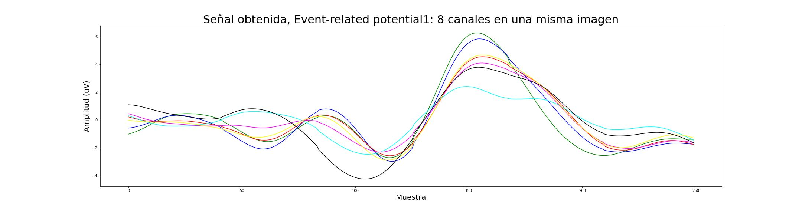

-----------------------------------------  
-----------------------------------------  
-----------------------------------------  
-----------------------------------------  
### ÚLTIMOS DETALLES:
- Embeber a_analisis_signal.ipynb en a_analisis_p300subject25_stim&type.ipynb.
OJO Si en el README está mencionado.
- Parrafo "Pulir" abajo.
- Revisar bien qué imágenes quedan y qué no.
- Llevo 3 .ipynb finalizados. Terminarlos todos.
- Chequear que todos los links estén bien y que todos los archivos se citen.
- Depurar funciones innecesarias.
-----------------------------------------  
-----------------------------------------  
-----------------------------------------  
-----------------------------------------  
   
# TRABAJO FINAL INTEGRADOR
## Análisis exploratorio de datos.
### Especialización en ciencia de datos ITBA  

Docente: *Rodrigo Ramele | rramele@itba.edu.ar*  
Estudiante: *Alexander Chavez | achavezmontano@itba.edu.ar*   
  
##### *Última actualización: 21/Ene/2023/09h*  

*A continuación, el análisis exploratorio de los datos que se usarán en el trabajo final integrador.* 
*El objetivo es dar al lector un "mapa" amigable donde pueda recorrer la información, entre descriptiva y código, para así tener una idea mas aproximada del trabajo que se está realizando*    

## 1. Intro.
La esclerosis lateral amiotrófica o ELA, es una enfermedad degenerativa de las neuronas en el cerebro, el tronco cerebral y la médula espinal que controlan el movimiento de los músculos voluntarios. En la ELA, las células nerviosas (neuronas) motoras se desgastan o mueren y ya no pueden enviar mensajes a los músculos. Con el tiempo, esto lleva a debilitamiento muscular, espasmos e incapacidad para mover los brazos, las piernas y el cuerpo. La afección empeora lentamente. Cuando los músculos en la zona torácica dejan de trabajar, se vuelve difícil o imposible respirar.  
  
En pacientes con ELA de etapas intermedias y avanzadas, es necesario el uso de dispositivos tecnológicos para la comunicación, como el P300 Speller.  

De forma paralela, es necesario explicar qué es una señal P300. La palabra *evocado* es clave: en medicina, refiere a una actividad que puede ser detectada sincrónicamente después de una cantidad específica de tiempo después del inicio de un estímulo. Si accidentalmente acercás un dedo a una vela, no. Si estamos a la espera de que un computador nos dé una señal visual y nos la da, en nuestro cerebro ocurre un evento de éste tipo. En términos médicos *es una actividad inducida*.  
  

    
La onda P300 es entonces, una señal en el cerebro con amplitud positiva relacionada con eventos. ¿Y cuáles son ésos eventos que ya están estudiados y verificados?: para éste caso, el más comúnmente provocado bajo el paradigma de "oddball" o "bicho raro":  
  
El sujeto, en éste caso el paciente, detecta un estímulo "objetivo" ocasional en un tren regular de estímulos estándar.  
La onda P300 solo ocurre si el sujeto participa activamente en la tarea de detectar los objetivos.  
Su amplitud varía con la improbabilidad de los objetivos.  
Su latencia varía con la dificultad de discriminar el estímulo objetivo de los estímulos estándar.  
Una latencia pico típica cuando un sujeto adulto joven hace una discriminación simple es de 300 ms.  
En pacientes con capacidad cognitiva disminuida, el P300 es más pequeño y más tardío que en sujetos normales de la misma edad.  
  
Se desconoce el origen intracerebral de la onda P300 y su papel en la cognición no se comprende con claridad. El P300 puede tener múltiples generadores intracerebrales, con el hipocampo y varias áreas de asociación de la neocorteza contribuyendo al potencial registrado en el cuero cabelludo. La onda P300 puede representar la transferencia de información a la conciencia, un proceso que involucra muchas regiones diferentes del cerebro.  

Fuente -> [*The P300 wave of the human event-related potential*](https://pubmed.ncbi.nlm.nih.gov/1464675/)    
    
## 2. Los datasets.  
Son tres grupos de datasets: el *ERPTemplate.mat.*, el grupo de los 8 archivos que conforman el *P300-Dataset* y el grupo de los *p300-subject-XX.mat*.  
  
Cada uno de ellos contiene uno o varios archivos .mat. Por practicidad [se encuentran todos en la carpeta *dataset*](dataset/)  
  
### 2a. El *ERPTemplate.mat*.
EL *ERPTemplate* contiene la señal que se utilizará para "drogar" el flujo de EEG basal.  
[Acá podés ir al análisis mas detallado de ésta señal.](a_analisis_ERPTemplate.ipynb)  
  
  
### 2b. El grupo de los 8 archivos que conforman el *P300-Dataset*.  

Dataset obtenido de las P300 de ocho **sujetos sanos**.  
Cabe resaltar que, en pacientes con capacidad cognitiva disminuida,  
el P300 es más pequeño y más tardío que en sujetos normales de la misma edad.  

Los archivos son P300SXX.mat.  

Este conjunto de datos se produjo utilizando el estándar 6x6 Donchin y Farewell P300 Speller Matrix, con un ISI de 0,125 ms.  
  
Hay 7 palabras con 5 letras cada una. Hay 10 secuencias de intensificación por letra.  
El procedimiento original usaba 3 palabras para el entrenamiento y trataba de decodificar las 4 palabras restantes para la prueba. 

Intente decodificar la palabra deletreada directamente desde la matriz EEG.  
Hay 7 palabras de 5 letras cada una.  
Cada letra está compuesta por 120 estímulos de la matriz P300, 6 filas y 6 columnas, diez veces cada una.  
El objetivo es decodificar las palabras deletreadas de las últimas 20 letras (4 palabras).  
Dado que el ISI es muy bajo, es difícil adquirir buenos rendimientos.  

[Descripción mas en detalle del dataset](a_analisis_P300XX.ipynb) 

Fuente -> [P300 dataset of 8 healthy subjects](https://www.kaggle.com/datasets/rramele/p300samplingdataset?resource=download)  
Éste dataset fue producido por el CiC, Universidad ITBA, Buenos Aires, Argentina.  

### 2c. El grupo de los *p300-subject-XX.mat*.  
  
Este dataset contiene toda la información de un EEG completo.

  
La primera obtención no nos da una visual clara, pero en él se encuentran los 8 canales que corresponden a cada electrodo instalado en la corteza cerebral. 

A manera informativa, seleccioné de manera aleatoria los canales 3, 4 y 6, para conocer un poco mas de cerca las componentes.  
  
  
  
  
  
## 3. Manipulación de la señal: "DrugSignal".  
Se "inyecta" el potencial evocado a una señal EEG.  
El objetivo es crear un dataset artificial con el que se testeará el modelo.  
  
[Acá podés ver el detalle de las modificaciones en fase y amplitud](a_analisis_funcion_DrugSignal.ipynb)   
  
-----------------------------------------  
  
Los papers que describren éste dataset son:  
  
[*1. Histogram of Gradient Orientations of Signal Plots Applied to P300 Detection*](https://www.frontiersin.org/articles/10.3389/fncom.2019.00043/full)    
[*2. EEG Waveform Analysis of P300 ERP with Applications to Brain Computer Interfaces*](https://www.mdpi.com/2076-3425/8/11/199)  

-----------------------------------------  

Texto por pulir:

El algoritmo sirve para alinear señales.  Hay un dataset del ITBA que tiene una base de EEG a la que se le puede agregar unas señales de P300 con cierto jitter.  
Con eso se forma un dataset sintético donde se podrácontrolar la señal específica de P300.  
Se podrá agregarle un jitter controlado y luego la idea es implementar y usar el algoritmo de Juliana para corregir el jitter,  alinear bien las señales.  
Al hacer eso, y ejecutar todo el código que genera la matriz de letras nuevamente, se podrá verificar si se obtiene un resultado mejor.  
  
  
## 4. Bibliografía extra.    
  
Paper en Discussion (cuando habla de la estabilidad):  
[*Histogram of Gradient Orientations of Signal Plots Applied to P300 Detection*](https://www.frontiersin.org/articles/10.3389/fncom.2019.00043/full)  
    
Implementación de la misma metodología para estudiar los diferentes métodos:  
[*EEG Waveform Analysis of P300 ERP with Applications to Brain Computer Interfaces*](https://www.mdpi.com/2076-3425/8/11/199)  
El trabajo final integrador es una extensión de este trabajo.  
  
[*Histogram of Gradient Orientations of Signal Plots Applied to P300 Detection*](https://www.frontiersin.org/articles/10.3389/fncom.2019.00043/full)    
    
  
----------------------------------------- 
  
#### Dataset real, donde se testeará lo realizado en el trabajo:
*Summary: This dataset represents a complete record of P300 evoked potentials recorded with BCI2000 using a paradigm originally described by Farwell and Donchin. In these sessions, 8 users with amyotrophic lateral sclerosis (ALS) focused on one out of 36 different characters. The objective in this contest is to predict the correct character in each of the provided character selection epochs.* [*Link al  .pdf.*](https://lampz.tugraz.at/~bci/database/008-2014/description.pdf)  
  
[*P300 speller with ALS patients (008-2014)*](http://bnci-horizon-2020.eu/database/data-sets) el 008-2014.  
  
----------------------------------------- 
    
Alexander Chavez | [LinkedIn](https://www.linkedin.com/in/alexchavez1980/)  